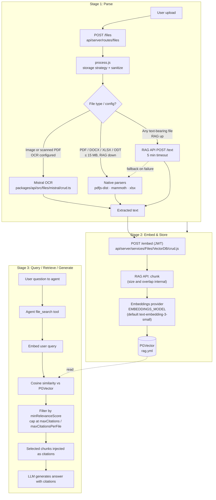

# LibreChat RAG Pipeline — Stage-by-Stage Architecture

Implementation walkthrough of the three stages a document goes through in LibreChat: **Parse → Embed & Store → Query / Retrieve / Generate**. File paths reference this repository.

## Diagram

---

## Stage 1 — Parse

**Goal:** Turn an uploaded file into clean, ordered text.

**Entry point:** `api/server/routes/files/files.js` → `api/server/services/Files/process.js`. The processor sanitizes filenames and dispatches to the active storage strategy (local, S3, Azure, Firebase).

**Three parsing paths, in order of preference:**

1. **RAG API** (`POST ${RAG_API_URL}/text`, `packages/api/src/files/text.ts`) — primary path when the RAG service is healthy. 10-second health check, 5-minute parse timeout. Handles the broadest set of formats.
2. **Mistral OCR** (`packages/api/src/files/ocr.ts`, `mistral/crud.ts`) — for image-only PDFs and scanned content. Requires `ocr` configured in `librechat.yaml`. Default model: `mistral-ocr-latest`.
3. **Native fallback parsers** (`packages/api/src/files/documents/crud.ts`) — used when the RAG API is unreachable or the file is one of: PDF (`pdfjs-dist`), DOCX (`mammoth`), Excel/ODS (`xlsx`), ODT (custom XML, 50 MB decompression cap). Hard limit: **15 MB per file**.

**Validation** (`packages/api/src/files/validation.ts`) enforces per-endpoint limits — e.g. Anthropic 32 MB / 100 pages, OpenAI 10 MB, Google 20 MB, Bedrock 4.5 MB (32 MB on Claude 4+/Nova). Encrypted PDFs are rejected on Anthropic.

**Why this stage matters for accuracy:**
- The native PDF path is text-only; it has no layout awareness, so multi-column PDFs and tables are linearised in a way that destroys semantics.
- If OCR is not configured, scanned content silently produces empty text — embeddings are generated over nothing.
- The 5-minute RAG timeout is the most common cause of "ingest hangs" on large files.

---

## Stage 2 — Embed & Store

**Goal:** Convert parsed text into vector chunks indexed for similarity search.

**Entry point:** `api/server/services/Files/VectorDB/crud.js` → `POST ${RAG_API_URL}/embed` with a short-lived JWT. The request includes `file_id`, the file stream, optional `entity_id`, and storage metadata.

**What the RAG API does internally:**
1. **Chunk** the text. Strategy lives in the Python `librechat-rag-api-dev` service — *not exposed via `librechat.yaml` or env vars*. This is the single biggest opaque box in the pipeline.
2. **Embed** each chunk using the provider configured by `EMBEDDINGS_PROVIDER` and `EMBEDDINGS_MODEL` (default: OpenAI `text-embedding-3-small`).
3. **Insert** vectors plus metadata into **PGVector** (`pgvector/pgvector:0.8.0-pg15-trixie`, see `rag.yml`).

**Lifecycle operations:**
- Re-embedding requires deleting the existing rows: `DELETE ${RAG_API_URL}/documents` with the file IDs.
- Vectors from different embedding models are **not comparable** — switching `EMBEDDINGS_MODEL` requires a full re-ingest.

**Why this stage matters for accuracy:**
- Chunk size, overlap, and splitter type are the strongest tuning levers for RAG quality, and they are not currently surfaced. Customers must accept the RAG API defaults.
- Embedding model choice is the second strongest lever. `text-embedding-3-large` is the recommended upgrade for non-trivial deployments (≈ 3× cost).
- Storage is plain cosine similarity in PGVector — no sparse / BM25 index, no keyword fallback.

---

## Stage 3 — Query, Retrieve, Generate

**Goal:** When the user asks a question, fetch the most relevant chunks and produce a grounded answer.

**Trigger:** An agent with `file_search` capability and embedded documents attached (`packages/api/src/files/agents/`, `resources.ts` categorises `embedded=true` files into the `file_search` tool resource).

**Flow:**
1. The agent invokes the `file_search` tool with the user's query (or a derivative of it).
2. The query is embedded with the same model used for indexing.
3. Cosine similarity is run against the PGVector store, scoped to the agent's files.
4. Results are filtered by `minRelevanceScore` (default `0.45`) and capped by `maxCitations` (default `30`) and `maxCitationsPerFile` (default `7`) — all configured in `librechat.yaml` under `endpoints.agents`.
5. Surviving chunks are injected as citations into the LLM context.
6. The agent generates the final answer with inline citations.

**What is *not* in this stage today:**
- **No reranker.** Cohere / Jina / Voyage rerankers exist in the codebase only for *web search* (`librechat.example.yaml` web search section), not for knowledge-base retrieval.
- **No agentic loop.** Retrieval is one-shot top-K; there is no query rewriting, multi-hop, HyDE, or read-then-refine loop on the indexed corpus.
- **No hybrid search.** Pure dense vector similarity, no BM25 union or sparse fallback for keyword/ID lookups.

**Why this stage matters for accuracy:**
- `minRelevanceScore` directly trades precision for recall. The default `0.45` is a generic compromise — production deployments should tune it per use case (see the data preparation guide).
- Without a reranker, the order of citations is whatever cosine similarity returns. Adding a cross-encoder rerank step here is the highest-leverage architectural improvement available.
- Citation budget (`maxCitations × avg chunk size`) must fit the chosen LLM's context window; over-large budgets degrade answer quality (lost-in-the-middle).

---

## Stage-level observability checklist

| Stage | What to monitor | Where |
|---|---|---|
| Parse | RAG API `/health`, parse-timeout rate, OCR error rate, native-fallback rate | RAG service logs; LibreChat server logs |
| Embed & Store | Embedding API errors / 429s, PGVector row count per file, re-embed jobs | RAG service logs; PG queries |
| Retrieve & Generate | Citations per request, % requests with zero citations, average top-K similarity, LLM token usage | Agent traces; LLM provider dashboard |

A "zero citations" rate above ~5 % usually means `minRelevanceScore` is too high *or* the docs were not parsed correctly in Stage 1.
