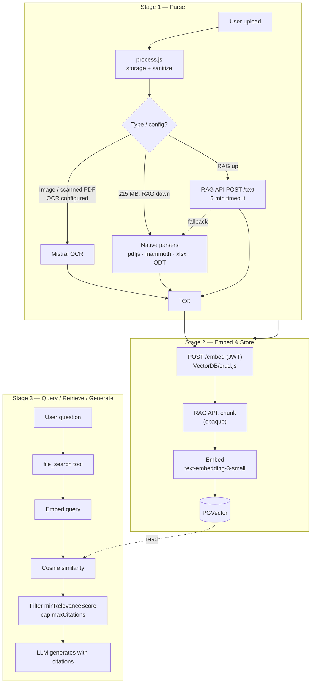

# RAG Pipeline — Operator One-Pager

**Audience:** platform operators, DevOps, engineers running LibreChat. For end-user authoring guidance, see `document-authoring-guide.md`.

## 1. How the pipeline works today

**Supported file formats:** PDF (text and scanned), Word (DOCX), Excel (XLSX, XLS, ODS), OpenDocument (ODT), Markdown, plain text, HTML, CSV, JSON, and common image formats. Image-only / scanned content requires OCR (`ocr` block in `librechat.yaml`, Mistral OCR).

## 2. Performance bottlenecks

| # | Bottleneck | Effect |
|---|---|---|
| 1 | Chunking is opaque (size/overlap fixed inside Python RAG API) | Cannot tune to content type |
| 2 | No reranker on RAG retrieval — pure cosine similarity | Top-K order is final order; weak precision |
| 3 | Native PDF parser is layout-blind (`pdfjs-dist`) | Tables, multi-column docs degrade silently |
| 4 | OCR is opt-in with silent failure | Scans ingest as empty text |
| 5 | One-shot retrieval, no agentic loop | No query rewriting / multi-hop |
| 6 | Default embedding `text-embedding-3-small` | Trails `-large` measurably on long / multilingual content |
| 7 | No hybrid (BM25 + dense) | Weak on IDs, codes, exact tokens |
| 8 | 15 MB native cap, 5 min RAG timeout, no progress feedback | Silent failures on large files |

## 3. Improvement opportunities

### Parse changes
- Replace native `pdfjs-dist` path with a layout-aware parser (Unstructured, LlamaParse, PyMuPDF) that preserves columns, tables, and headings.
- Default-route table-heavy PDFs through OCR-with-layout, not text extraction.
- Surface parse errors (timeout, OCR-skipped, encrypted PDF) back to the uploader instead of silent fallback.
- Lift the 15 MB native cap or stream large files end-to-end through the RAG API.

### Chunking
- Expose chunk size / overlap / splitter type in `librechat.yaml` (currently fixed inside the RAG service).
- Move from fixed-size to **semantic / heading-aware chunking** (split on H1/H2, never mid-sentence).
- Provide per-content-type defaults: smaller chunks for legal/policy, larger for transcripts and prose.
- Persist parent-document and section metadata on each chunk for better citation context.

### Strategy
- **Hybrid search:** add BM25 / lexical index alongside PGVector and union with reciprocal rank fusion. Closes the gap on IDs, SKUs, code, exact phrases.
- **Query rewriting / expansion / HyDE** before retrieval — generate paraphrases or a hypothetical answer and embed those instead of the raw question.
- Upgrade default embedding to `text-embedding-3-large` (or a modern open model). Re-embed the corpus after the switch.
- Persist multiple embeddings per chunk (e.g. dense + ColBERT-style late interaction) for high-precision domains.

### Agentic file search
- Replace one-shot top-K with a **multi-step loop**: query rewrite → retrieve → read → refine → final answer.
- Let the agent issue follow-up retrieval calls, jump from a citation into the surrounding section, and stop when confidence is high.
- Expose a `read_section` tool so the agent can pull a full section, not only similarity-matched chunks.

### Reranking
- Insert a **cross-encoder rerank** stage between vector hit and citation selection.
- Use Cohere Rerank, Jina Reranker, or Voyage Rerank — already integrated in the codebase for *web search* (`librechat.example.yaml`); apply the same pattern to `file_search`.
- Highest accuracy-per-engineering-effort lever available; typical recall@5 improvement is 10–25 % on knowledge-base benchmarks.

## 4. Configuration starting points

| Setting | Where | Recommended |
|---|---|---|
| `EMBEDDINGS_MODEL` | `.env` | `text-embedding-3-large` for any non-trivial deployment |
| `ocr` | `librechat.yaml` | Always enable (`mistral_ocr` strategy) |
| `minRelevanceScore` | `librechat.yaml` → `endpoints.agents` | `0.55`–`0.65` precision-first; `0.45` balanced; `0.30`–`0.35` recall-first |
| `maxCitations` / `maxCitationsPerFile` | same | `20` / `5` balanced; `10` / `3` precision-first |
| `serverFileSizeLimit` | `librechat.yaml` → `fileConfig` | `50` MB; restrict `supportedMimeTypes` to formats you parse well |

## 5. Operations

- **Re-ingest required** when changing `EMBEDDINGS_MODEL` or chunking — vectors from different models are not comparable. `DELETE ${RAG_API_URL}/documents` then re-upload.
- **Health:** `GET ${RAG_API_URL}/health` (10 s timeout); alert above 1 % failure.
- **Watch:** % requests with zero citations (> 5 % usually means threshold too high or Stage 1 failed), parse-timeout rate, OCR error rate, embedding-API 429s.

## Reference paths

- Routes: `api/server/routes/files/files.js`
- Process: `api/server/services/Files/process.js`
- Native parsers: `packages/api/src/files/documents/crud.ts`
- OCR: `packages/api/src/files/mistral/crud.ts`, `ocr.ts`
- RAG client: `api/server/services/Files/VectorDB/crud.js`, `packages/api/src/files/text.ts`
- Validation: `packages/api/src/files/validation.ts`
- RAG service: `rag.yml` (`librechat-rag-api-dev` + `pgvector`)
