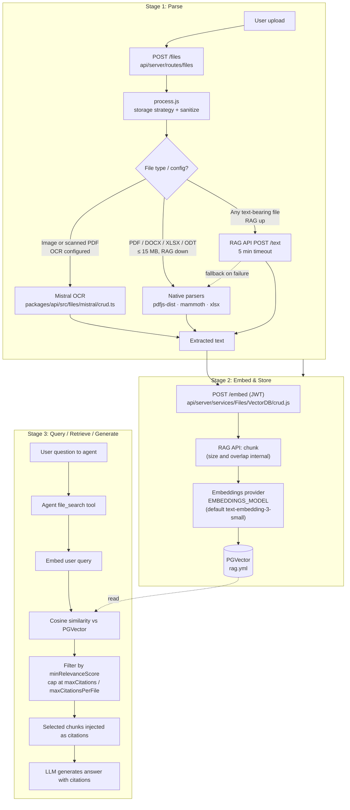

# LibreChat RAG Platform Guide

**Audience:** Platform operators, DevOps, and engineers running LibreChat for an organization. This document covers architecture, configuration, known bottlenecks, and operational runbook items for the file-search / RAG pipeline.

For end-user document-authoring guidance, see `document-authoring-guide.md`.

---

## 1. Pipeline overview

A document goes through three stages:

1. **Parse** — extract text from the uploaded file.
2. **Embed & Store** — chunk the text, embed each chunk, persist vectors.
3. **Query, Retrieve, Generate** — embed the user query, run similarity search, inject citations into the LLM.



---

## 2. Stage 1 — Parse

**Entry point:** `api/server/routes/files/files.js` → `api/server/services/Files/process.js`. The processor sanitizes filenames and dispatches to the active storage strategy (local, S3, Azure, Firebase).

**Three parsing paths, in order of preference:**

| Path | Used when | Code |
|---|---|---|
| RAG API `/text` | RAG service healthy (broadest format coverage) | `packages/api/src/files/text.ts` (10 s health check, 300 s parse timeout) |
| Mistral OCR | Image-only PDFs, scans; requires `ocr` configured | `packages/api/src/files/mistral/crud.ts` (`mistral-ocr-latest`) |
| Native fallback | RAG API down, file ≤ 15 MB | `packages/api/src/files/documents/crud.ts` (PDF via `pdfjs-dist`, DOCX `mammoth`, XLSX/ODS `xlsx`, ODT custom XML, 50 MB decompression cap) |

**Validation** (`packages/api/src/files/validation.ts`) enforces per-endpoint limits:
- Anthropic: 32 MB / 100 pages, encrypted PDFs rejected
- OpenAI: 10 MB
- Google / Vertex: 20 MB
- Bedrock: 4.5 MB (32 MB on Claude 4+ / Nova for PDFs)

**Stage-1 risks**
- The native PDF path is text-only; multi-column PDFs and tables are linearised in ways that destroy semantics.
- If OCR is not configured, scanned content silently produces empty text — embeddings are then computed over nothing.
- The 5-minute RAG timeout is the most common cause of "ingest hangs" on large files.

---

## 3. Stage 2 — Embed & Store

**Entry point:** `api/server/services/Files/VectorDB/crud.js` → `POST ${RAG_API_URL}/embed` with a short-lived JWT. Payload: `file_id`, file stream, optional `entity_id`, storage metadata.

**Inside the RAG API (Python service, container `librechat-rag-api-dev`):**
1. **Chunk** the text — strategy *not exposed* via `librechat.yaml` or env vars.
2. **Embed** each chunk via `EMBEDDINGS_PROVIDER` / `EMBEDDINGS_MODEL` (default OpenAI `text-embedding-3-small`).
3. **Insert** vectors and metadata into **PGVector** (`pgvector/pgvector:0.8.0-pg15-trixie`, see `rag.yml`).

**Lifecycle:**
- Re-embedding requires deleting existing rows: `DELETE ${RAG_API_URL}/documents`.
- Vectors from different embedding models are **not comparable** — switching `EMBEDDINGS_MODEL` requires a full re-ingest.

**Stage-2 risks**
- Chunk size, overlap, and splitter type are the strongest tuning levers for RAG quality and are not currently surfaced. The platform team must accept the RAG API defaults or fork the service.
- Storage is plain cosine similarity — no sparse / BM25 index, no keyword fallback for IDs and codes.

---

## 4. Stage 3 — Query, Retrieve, Generate

**Trigger:** an agent with `file_search` capability and embedded documents attached (`packages/api/src/files/agents/`, `resources.ts` categorises `embedded=true` files into the `file_search` tool resource).

**Flow:**
1. Agent invokes `file_search` with the user query.
2. Query is embedded with the same model used for indexing.
3. Cosine similarity against PGVector, scoped to the agent's files.
4. Filter by `minRelevanceScore`; cap with `maxCitations` and `maxCitationsPerFile`.
5. Surviving chunks injected as citations into the LLM context.
6. Agent generates the answer with inline citations.

**What is not in this stage today**
- **No reranker on RAG retrieval.** Cohere / Jina / Voyage rerankers exist in the codebase only for *web search* (`librechat.example.yaml` web search section).
- **No agentic loop.** Retrieval is one-shot top-K; no query rewriting, multi-hop, HyDE, or read-then-refine on the indexed corpus.
- **No hybrid search.** Pure dense vector similarity only.

---

## 5. Configuration reference

Concrete starting values, not just available knobs.

### Embeddings (`.env`)
```
EMBEDDINGS_PROVIDER=openai
EMBEDDINGS_MODEL=text-embedding-3-large
```
Use `text-embedding-3-large` as the default for any non-trivial deployment. ~3× cost vs `-small`, measurable recall improvement on long, technical, or multilingual content. Keep `-small` only for cost-sensitive English-only FAQ-style corpora.

### OCR (`librechat.yaml`)
Always enable, even for "text-only" deployments — scanned files always slip in:
```yaml
ocr:
  apiKey: '${OCR_API_KEY}'
  baseURL: 'https://api.mistral.ai/v1'
  mistralModel: 'mistral-ocr-latest'
  strategy: mistral_ocr
```

### Retrieval thresholds (`librechat.yaml` → `endpoints.agents`)

| Use case | `minRelevanceScore` | `maxCitations` | `maxCitationsPerFile` |
|---|---|---|---|
| Customer support / FAQ (precision-first) | `0.55`–`0.65` | `10`–`15` | `3`–`5` |
| Internal knowledge base (balanced, default) | `0.45` | `20`–`30` | `5`–`7` |
| Research / discovery (recall-first) | `0.30`–`0.35` | `30`–`50` | `7`–`10` |

Lower threshold = more recall, more noise. Raise the threshold if the model frequently hallucinates from low-similarity chunks.

### File limits (`librechat.yaml` → `fileConfig`)
- `serverFileSizeLimit: 50` MB — keep under the 15 MB native parser cap unless the RAG API path is validated for larger files.
- `endpoints.agents.fileLimit: 10` — useful upper bound; more files dilute retrieval.
- Restrict `supportedMimeTypes` to formats you actually parse well (PDF, DOCX, MD, TXT, CSV, XLSX). Block image-only formats unless OCR is enabled.

---

## 6. Known bottlenecks

1. **Chunking is opaque.** Size, overlap, and splitter type live inside the Python RAG API and are not configurable from LibreChat.
2. **No reranker on RAG retrieval.** Pure cosine similarity; no cross-encoder rescoring.
3. **Native PDF parser is layout-blind.** Tables, columns, sidebars degrade silently.
4. **OCR is opt-in with silent failure.** Scanned PDFs without OCR ingest as empty text.
5. **15 MB native parser limit + 5-min RAG timeout** with no progress feedback.
6. **One-shot retrieval, no agentic loop.** No query rewriting or multi-hop retrieval.
7. **Default embedding model trails state of the art.** `text-embedding-3-small` is fine for cost; `-large` and modern open models recall measurably better.

## 7. Improvement opportunities (ranked by accuracy/effort ratio)

1. **Add a reranker stage** (Cohere Rerank, Jina Reranker, or Voyage Rerank) between vector hit and citation selection. Highest leverage by far.
2. **Expose chunking knobs** in `librechat.yaml` so admins can match content type (legal/policy vs. code vs. transcripts).
3. **Replace the native PDF path** with a layout-aware parser (Unstructured, LlamaParse, PyMuPDF) and route table-heavy PDFs through OCR-with-layout.
4. **Agentic file search**: query rewrite → retrieve → read → refine loop instead of single top-K.
5. **Hybrid search (BM25 + vector)** for keyword-heavy domains (legal, code, IDs, SKUs).
6. **Surface ingestion errors** (timeout, OCR-skipped, encrypted PDF) back to the user instead of silent fallback.

---

## 8. Operational runbook

### Re-ingest after model change
1. Stop new uploads to the affected agent.
2. `DELETE ${RAG_API_URL}/documents` for all affected file IDs (or drop the relevant PGVector rows).
3. Update `EMBEDDINGS_MODEL`.
4. Trigger re-upload / re-embed.

### Health checks
- `GET ${RAG_API_URL}/health` — used internally with a 10 s timeout. Alert on > 1 % failure rate.
- PGVector connectivity from the RAG API container.
- Embedding provider quota / 429s.

### Common failure modes and remediation

| Symptom | Likely cause | Action |
|---|---|---|
| Empty / nonsensical citations | Scanned PDF, OCR not configured | Configure `ocr` block; backfill via re-ingest |
| Ingest hangs > 5 min | RAG API timeout on large file | Split file; check RAG API resources |
| "Cannot find" content known to be ingested | Layout broken in Stage 1 (multi-column PDF) | Re-ingest after re-export to DOCX/MD |
| Wrong file cited | Generic filenames; topic overlap across agents | Rename; isolate topics across agents |
| Numeric/ID lookups miss | Pure dense retrieval weak on tokens | Surround IDs with descriptive text; long-term: hybrid search |
| Hallucinated answers from low-relevance chunks | `minRelevanceScore` too low | Raise threshold to `0.55`+ |
| Stale answers after doc updates | Old vectors not deleted on re-upload | Confirm `DELETE /documents` is called before re-embed |

---

## 9. Observability checklist

| Stage | What to monitor | Where |
|---|---|---|
| Parse | RAG API `/health`, parse-timeout rate, OCR error rate, native-fallback rate | RAG service logs; LibreChat server logs |
| Embed & Store | Embedding API errors / 429s, PGVector row count per file, re-embed jobs | RAG service logs; Postgres queries |
| Retrieve & Generate | Citations per request, % requests with zero citations, average top-K similarity, LLM token usage | Agent traces; LLM provider dashboards |

A "zero citations" rate above ~5 % usually means `minRelevanceScore` is too high *or* documents were not parsed correctly in Stage 1.
